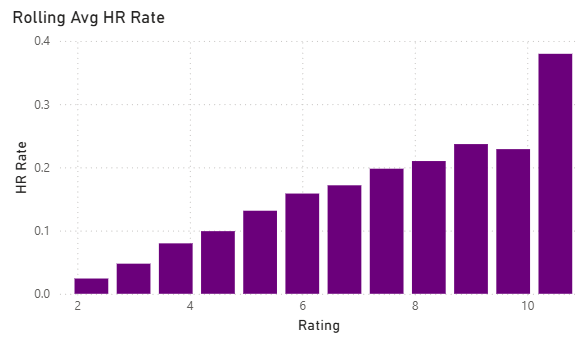
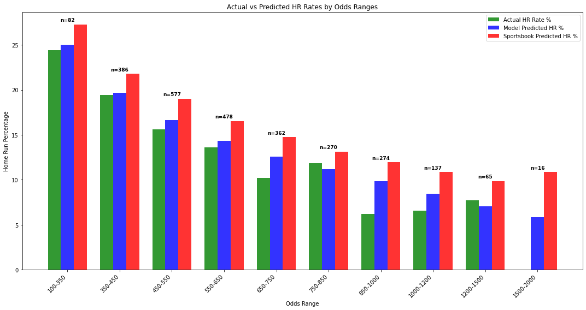

# Using ML to Find Value in HR Betting Markets

Over the past few years, the market for sports betting has skyrocketed, from around $13b wagered in 2019 to $113b wagered in 2023. One of the more popular bets that sportbooks's receive is bets on home run props, and due to the relative rarity of home runs, these types of bets usually end up being one of the best moneymakers. For my senior year capstone project, I thought it would be a fun task to create a model that aims to find value in the market that can beat the sportsbooks in the long-term.

## Data

The data for this project was obtaine using the Python library PyBaseball, which I used to obtain data on over 6.5 million pitches from 2015-2025. For the stats I collected, I mainly used "Statcast" stats, so-called because they first became available in 2015 with the inception of Statcast. These stat's include things like average exit velocity, xwOBACON, barrel rate, etc. Since these stats contain very little context regarding the players batted ball distribution and plate discipline, I also included some non-Statcast data, such as groundball to flyball ratio, line drive rate, swing rate, chase rate, and whiff rate.

On the pitcher's side, I also included stats regarding their pitch and release point data. These include spin rate, velocity, release extension, and movement. While these are unlikely to have a massive impact on home runs allowed, their inclusion was important because these are the stats that a pitcher has the most control over.

## Model Coefficients and Ratings:

Originally, I attempted to utilize logistic regression, gradient boosting, and random forrest models to predict which matchup would result in a home run. However, due to the rarity of a home run occuring, all 109k matchups I predicted resulted in a 0. Realizing that a classification model wouldn't work, I pivoted to predicting a continuous variable, specifically, the home run rate relative to the league average. 

Since a lot of my stats will likely have some multicollinearity, I decided on using a LASSO regression model to reduce the effects of that as best I can. For the batters, this reduced the original 12 features down to 9, and reduced the pitching features from 16 to 8

### Batters

### Pitchers

### Create Ratings

After getting these ratings for each player, I then put the ratings through a series of operations and modifiers to create a final rating, including modifiers for both handedness and stadium, as well as starter and bullpen specific ratings, based on the expected plate apperance count for the starter-batter matchup, as well as the batter's expected total PA count

## Model Results

After finishing the ratings, I took a little over 2 weeks to acquire real-time data to publish results. The results you see are based on 2,649 observations acquired between July 3rd and July 21st, 2025.

Now that it can be seen that higher ratings do in fact correlate to higher home run rates, I then tested the home run rates relative to actual, to see where my model might have value over the sportsbooks.

While this plot does show that my model is closer to predicting the actual HR rate than the sportsbooks, it also shows that there is no range where my model overperforms them. Since I had originally pulled odds from sportsbooks such as Fanduel and DraftKings, who only offer over bets on home runs, they can hide substantially more vig in their odds. I decided to instead pull odds from sites like MGM and ESPN, since those offer double-sided odds, and bet on the unders. The results went well enough that, later on, I also added in over betting. Thoguh my sample is still under 200 total picks, here are the backtested results from August 6th, 2025 through the end of the season:

Unders: 113-13, 5.1% ROI

Overs: 9-37, 20.8% ROI

Total: 122-50, 9.2% ROI

### Future Work

These 172 backtested selections are far from enough data to call the model a success. For one thing, it is a small sample size (particularly on the overs side), but backtesting in general cannot be used to show that the model will work in the future. Though historical home run odds are very difficult to find, I should be able to get data at least from all of the 2025 season, if not prior to that, in a few weeks. Until then, this data is really nothing more than promising.
