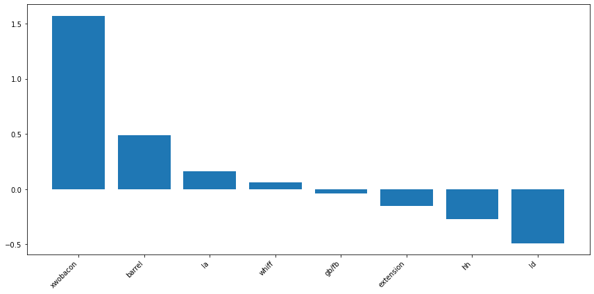
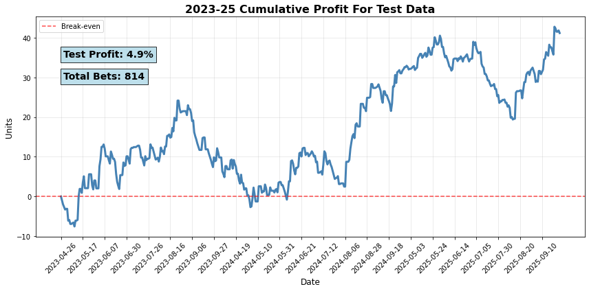

# Using ML to Find Value in HR Betting Markets

Over the past few years, the market for sports betting has skyrocketed, from around $13b wagered in 2019 to $113b wagered in 2023. One of the more popular bets that a sportsbooks will receive is bets on home run props, and due to the relative rarity of home runs, these types of bets usually end up making a lot of money for the sportsbooks. For my senior year capstone project, I thought it would be a fun task to create a model that aims to find value in the market consistently enough to beat the sportsbooks in the long-run.

## Data

The data for this project was obtained using the Python library PyBaseball, which I used to obtain data on over 6.5 million pitches from 2021-2025. For the stats I collected, I mainly used "Statcast" stats, so-called because they first became available in 2015 with the inception of Statcast. These stats include things like average exit velocity, xwOBACON, barrel rate, etc. Since these stats contain very little context regarding the players batted ball distribution and plate discipline, I also included some non-Statcast data, such as groundball to flyball ratio, line drive rate, swing rate, chase rate, and whiff rate.

On the pitchers side, on top of the batters stats, I also included stats regarding their pitch and release point data. These include spin rate, velocity, release extension, and movement. While these are unlikely to have a massive impact on home runs allowed, their inclusion was important because these are the stats that a pitcher has the most control over.

## Model Coefficients and Ratings:

Originally, I attempted to utilize logistic regression, gradient boosting, and random forest models to predict which matchup would result in a home run. However, due to the rarity of a home run, all 109k observations resulted in a 0. Realizing that a classification model wouldn't work, I pivoted to predicting a continuous variable, specifically, the home run rate (home runs per batted ball event) relative to the league average. 

Since a lot of my stats will likely have some multi-collinearity, I decided on using a LASSO regression model to reduce the effects of that as best I can. For the batters, this reduced the original 12 features down to 9, and reduced the pitching features from 16 to 8

### Batters

### Pitchers

### Create Odds

After getting these ratings for each player, I then put the ratings through a series of operations and modifiers to create a final rating, including modifiers for both handedness and stadium, as well as unique ratings for the batter's matchup vs both the starting pitcher and the bullpen. These were based on the expected plate appearance count for the starter-batter matchup, as well as the batter's expected total PA count. I then used this overall rating to create an "under" and "over" rating. These ratings were then blended with a sportsbooks' posted odds for that player's under and over respectively to give us our model-predicted odds for a home run.

## Model Results

After predicting our own odds for 85k observations across the 2023-2025 seasons, I split them into train and test sets and found the most ideal blend of sportsbook vs model weighting, the proper amount of "advantage" the model saw in the bet, and the proper threshold. I tracked the total bet numbers and ROI for the training set here:

#### Unders
307 Bets, 3.1% profit

#### Overs:
318 Bets, 5.2% Profit

Very promising! Overall, the test set had 625 bets across its 35k observations, and produced an ROI of over 4%. It should be noted that the training data actually produced a worse result, overall posting a 3.1% ROI across 946 bets, so we might expect future results to be somewhere in between the two outcomes. Accounting for this, if we move forward with an estimate of 3.5% profit, prorated at around 675 bets per season, the expected return would be around 23-24 units. For reference the "unit" is whatever your average bet size is. so, if you bet $10 on every single bet for a full season, you would expect to make $230-240 overall. To double check reliability, I ran the numbers on a per-year basis for both unders and overs. Both were successful for 2 out of the 3 years in the sample, and in both cases, the year that did not match the success had the smallest sample. 

### Future Work

Though these results are highly encouraging, I believe I have a lot more to work on. While I believe my method for determining a batter's "power rating" is of sound process, I cannot say the same for pitchers. As it currently stands, the features for pitchers contain stats that correlate with giving up home runs, and stats that are sticky year-over-year, but these two groups are mutually exclusive. In a future 2.0 version, I would have to spend some time to create a model similar to many Stuff+ models you may see on the internet, but just simply for home runs. Outside of that, things like weather/time of year and pulled fly-ball rate will also have to be added, as those have more recently come to my attention as stats that can have a significant impact on home runs. For now, I believe this is very encouraging, but can still improve in some big ways.
