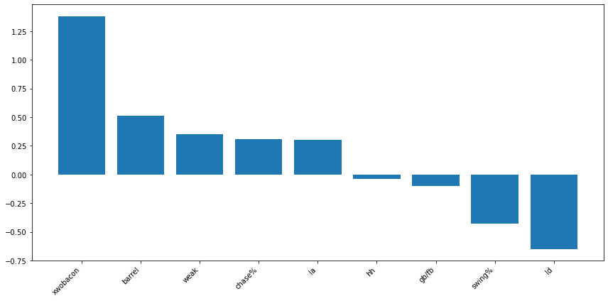

# Using ML to Find Value in HR Betting Markets

Over the past few years, the market for sports betting has skyrocketed, from around $13b wagered in 2019 to $113b wagered in 2023. One of the more popular bets that sportbooks's receive is bets on home run props, and due to the relative rarity of home runs, these types of bets usually end up being one of the best moneymakers. For my senior year capstone project, I thought it would be a fun task to create a model that aims to find value in the market that can beat the sportsbooks in the long-term.

## Data

The data for this project was obtaine using the Python library PyBaseball, which I used to obtain data on over 6.5 million pitches from 2015-2025. For the stats I collected, I mainly used "Statcast" stats, so-called because they first became available in 2015 with the inception of Statcast. These stat's include things like average exit velocity, xwOBACON, barrel rate, etc. Since these stats contain very little context regarding the players batted ball distribution and plate discipline, I also included some non-Statcast data, such as groundball to flyball ratio, line drive rate, swing rate, chase rate, and whiff rate.

On the pitcher's side, I also included stats regarding their pitch and release point data. These include spin rate, velocity, release extension, and movement. While these are unlikely to have a massive impact on home runs allowed, their inclusion was important because these are the stats that a pitcher has the most control over.

## Model Coefficients and Results:

Originally, I attempted to utilize logistic regression, gradient boosting, and random forrest models to predict which matchup would result in a home run. However, due to the rarity of a home run occuring, all 109k matchups I predicted resulted in a 0. Realizing that a classification model wouldn't work, I pivoted to predicting a continuous variable, specifically, the home run rate relative to the league average. 

Since a lot of my stats will likely have some multicollinearity, I decided on using a LASSO regression model to reduce the effects of that as best I can. For the batters, this reduced the original 12 features down to 9, and reduced the pitching features from 16 to 9

### Batters

